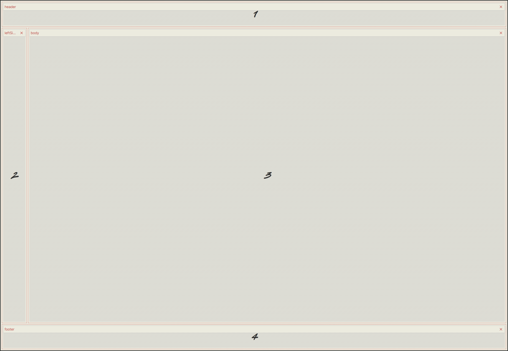

## Step 1: 建立專案
1. 使用 vite 建立 vue.js + typescript 專案
2. CSS 使用 tailwindcss v4
3. 使用 vue-router 建立路由
4. 使用 pinia 建立狀態管理

## Step 2: 建立頁面

1. 建立首頁 `src/pages/Home.vue`
2. layout 請參考 
3. 首頁包含以下區塊
   - 標題列
   - 主要內容區域
   - 側邊欄 - 頁面左側
   - 頁尾
  
## Step 3: 標題列

1. 使用 router name 顯示當前路由名稱

## Step 4: 側邊欄

1. 使用陣列儲存各個 routes 資訊，並使用 v-for 迴圈顯示，route 資訊如下:
  ```ts
  const routes = [
    { name: '首頁', path: '/' },
    { name: '請假', path: '/leave' },
  ]
  ```
2. routes 陣列在側邊欄來顯示各個 router link

## Step 5: 主要內容區域 page

1. 建立請假 page `src/pages/Leave.vue`
2. 請假 page 需要以下欄位
  - 姓名 - input
  - 時間 datetime picker
  - 假別 - select (特休、病假、事假、公假)
  - 事由 - textarea
  - 代理人 - input