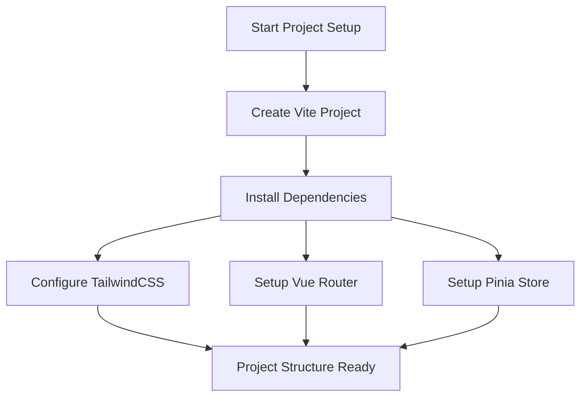

# Project Implementation Plan - Step 1

## Overview
This plan outlines the implementation of Step 1 from the TODO list, which involves setting up a Vue.js project with TypeScript using Vite, along with additional tooling.

## Detailed Steps

### 1. Create Vue.js + TypeScript project using Vite
- Use command: `npm create vite@latest`
- Select Vue + TypeScript template
- Initialize project and install base dependencies

### 2. Install and Configure TailwindCSS v4
- Install required packages
- Create and configure tailwind.config.js
- Set up CSS imports

### 3. Setup Vue Router
- Install vue-router
- Create router configuration
- Set up base route structure

### 4. Setup Pinia
- Install pinia
- Configure pinia store
- Create base store structure